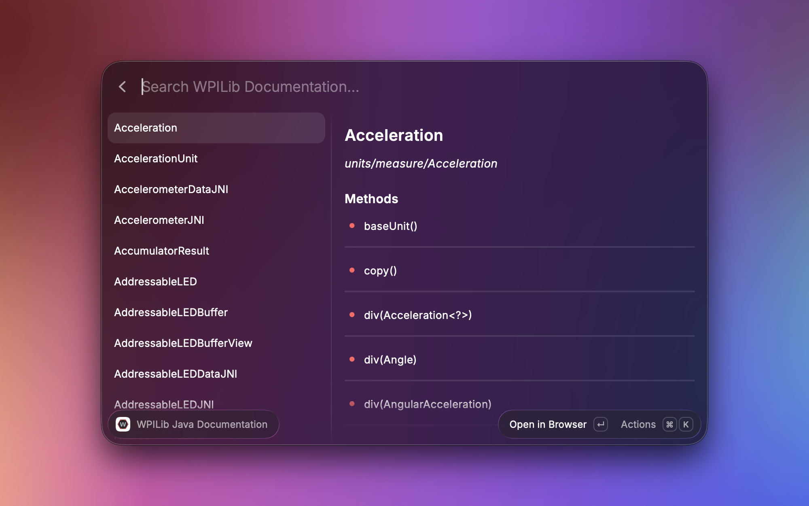
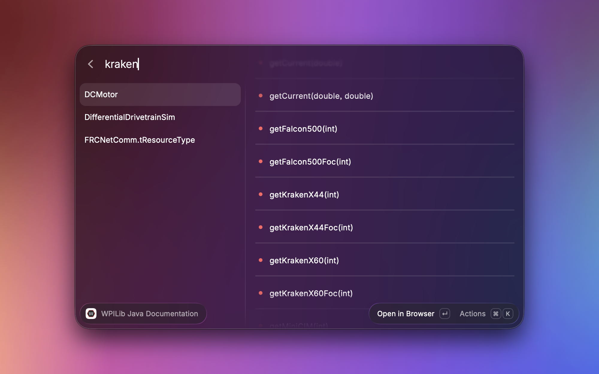
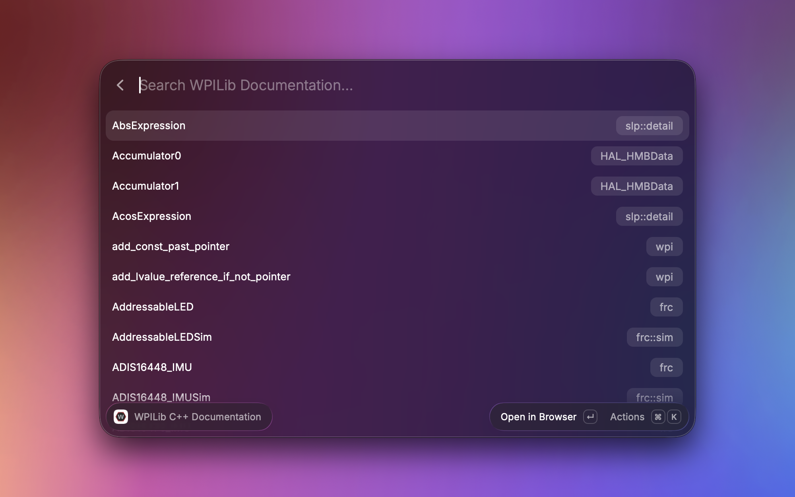
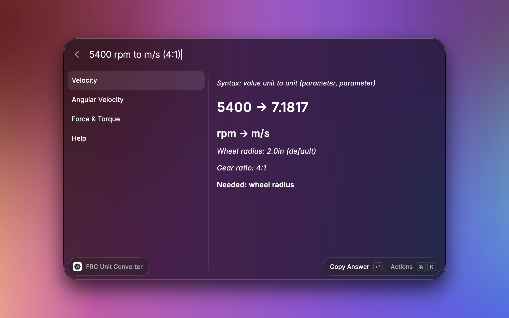

# FRC Programming

A Raycast extension for FRC (FIRST Robotics Competition) programmers, giving quick access to WPILib documentation and common unit conversions.

[Raycast](https://www.raycast.com/) is a macOS/Windows launcher that lets developers run commands, search, and build custom extensions like this one directly from a keyboard shortcut. [WPILib](https://docs.wpilib.org/en/stable/index.html) is the standard software library teams use to write robot code for FRC, a robotics competition for high school students where teams build and program robots to compete in a yearly game.

### Features

- WPILib Java Documentation — search WPILib's Java API classes and methods directly

- WPILib C++ Documentation — search WPILib's C++ API classes

- FRC Status Light Reference — jump straight to WPILib's reference page for status light patterns on FRC hardware components
- FRC Unit Converter — convert between units commonly used in FRC robot code, including velocity, angular velocity, torque, and force.

Rather than scraping documentation HTML, the Java and C++ commands fetch the search index files for each documentation, parse them into structured data, and cache the results locally so repeat searches are instant.

### AI Usage
I used AI for debugging and to generate regex expressions (primarily for the regex expressions in the documentation search files and for the couple lines of regex expressions in unit converter)

### Installation Instructions (until the extension gets approved)

1. Make sure you have [Raycast](https://www.raycast.com/) installed
2. Install the extension at: [FRC Programming Extension](https://www.raycast.com/helloGithub326/frc-programming)
